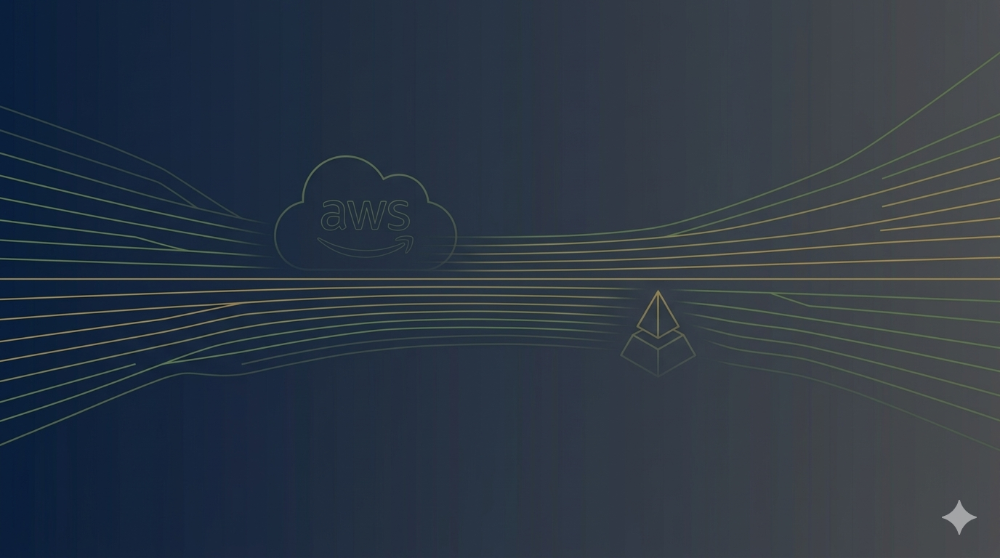

  
  
  # Hi, I'm [Your Name] 👋
  ### ☁️ Aspiring Solutions Architect | AWS & DevOps Enthusiast
  
  *Sourcing scalable, cost-efficient cloud infrastructures through automated IAC pipelines.*

  
  

---
## 🛠️ My Architecture Stack

| Category | Tools |
| :--- | :--- |
| **Cloud & Infra** |    |
| **DevOps / CI/CD** |    |
| **Backend** |    |
