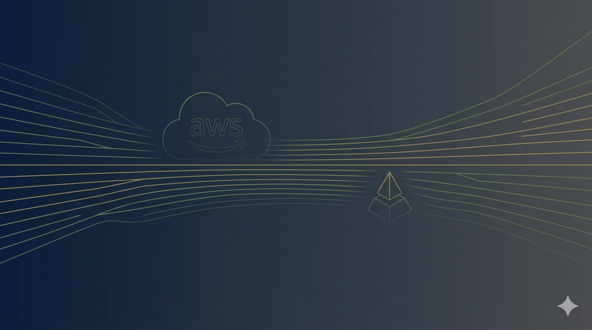

  

  # Future Solutions Architect & Cloud Engineer
  **"Engineering high-availability systems where code meets infrastructure."**
  
  *18-year-old high school senior focusing on AWS Cloud Architecture, IaC, and Scalable DevOps Pipelines.*

---

## Technical Stack & Expertise

| Domain | Skill Icons | Primary Tools |
| :--- | :--- | :--- |
| **Cloud Infrastructure** |  | **AWS, Terraform, Linux (Debian/RHEL)** |
| **DevOps & CI/CD** |  | **GitHub Actions, Docker, Kubernetes, Jenkins** |
| **Backend & Logic** |  | **Java (Spring Boot), Python (Pandas, Numpy), C#** |
| **Data & Messaging** |  | **MySQL, RabbitMQ (Messaging), Memcached (Caching)** |
| **Frontend** |  | **HTML, CSS, JS** |

---

## My Key Projects

  

